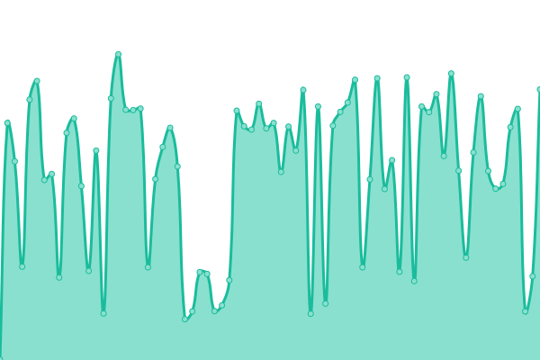
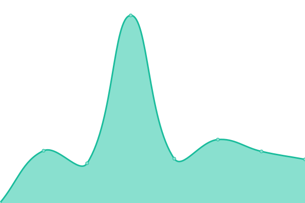
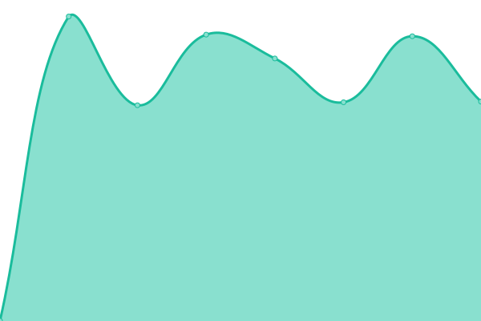

# [📈 Live Status](https://uptime.fourfats.com): <!--live status--> **🟩 All systems operational**

<!--start: status pages-->
<!-- This summary is generated by Upptime (https://github.com/upptime/upptime) -->
<!-- Do not edit this manually, your changes will be overwritten -->
<!-- prettier-ignore -->
| URL | Status | History | Response Time | Uptime |
| --- | ------ | ------- | ------------- | ------ |
|  [Fatlands](https://fatlands.fourfats.com) | 🟩 Up | [fatlands.yml](https://github.com/FourFats/uptime/commits/HEAD/history/fatlands.yml) | 

 723ms
     
 | 

<a href="https://uptime.fourfats.com/history/fatlands">100.00%</a>
    

|  [Maximus2](https://maximus2.fourfats.com/health) | 🟩 Up | [maximus2.yml](https://github.com/FourFats/uptime/commits/HEAD/history/maximus2.yml) | 

 734ms
     
 | 

<a href="https://uptime.fourfats.com/history/maximus2">100.00%</a>
    

|  [Blackmoor2](https://blackmoor2.fourfats.com/health) | 🟩 Up | [blackmoor2.yml](https://github.com/FourFats/uptime/commits/HEAD/history/blackmoor2.yml) | 

 317ms
     
 | 

<a href="https://uptime.fourfats.com/history/blackmoor2">99.38%</a>
    

|  [ToonShooters2](https://toonshooters2.fourfats.com/api/getranks) | 🟩 Up | [toon-shooters2.yml](https://github.com/FourFats/uptime/commits/HEAD/history/toon-shooters2.yml) | 

 322ms
     
 | 

<a href="https://uptime.fourfats.com/history/toon-shooters2">100.00%</a>
    

|  [Website](http://www.fourfats.com) | 🟩 Up | [website.yml](https://github.com/FourFats/uptime/commits/HEAD/history/website.yml) | 

 755ms
     
 | 

<a href="https://uptime.fourfats.com/history/website">100.00%</a>
    

|  [Website .cn](http://www.fourfats.cn) | 🟩 Up | [website-cn.yml](https://github.com/FourFats/uptime/commits/HEAD/history/website-cn.yml) | 

 2311ms
     
 | 

<a href="https://uptime.fourfats.com/history/website-cn">100.00%</a>
    

|  [Signalling](https://signalling.fourfats.com) | 🟩 Up | [signalling.yml](https://github.com/FourFats/uptime/commits/HEAD/history/signalling.yml) | 

 715ms
     
 | 

<a href="https://uptime.fourfats.com/history/signalling">100.00%</a>
    

|  [STUN](206.189.89.149) | 🟩 Up | [stun.yml](https://github.com/FourFats/uptime/commits/HEAD/history/stun.yml) | 

 222ms
     
 | 

<a href="https://uptime.fourfats.com/history/stun">100.00%</a>
    

|  [Superboys](http://superboys.fourfats.com:3001/heath) | 🟩 Up | [superboys.yml](https://github.com/FourFats/uptime/commits/HEAD/history/superboys.yml) | 

 468ms
     
 | 

<a href="https://uptime.fourfats.com/history/superboys">100.00%</a>
    

|  [GameJam2018](http://gamejam2018.fourfats.com) | 🟩 Up | [game-jam2018.yml](https://github.com/FourFats/uptime/commits/HEAD/history/game-jam2018.yml) | 

 284ms
     
 | 

<a href="https://uptime.fourfats.com/history/game-jam2018">100.00%</a>
    

|  [SmashClub](https://smashclub.fourfats.com:2096) | 🟩 Up | [smash-club.yml](https://github.com/FourFats/uptime/commits/HEAD/history/smash-club.yml) | 

 495ms
     
 | 

<a href="https://uptime.fourfats.com/history/smash-club">100.00%</a>
    

|  [Blackmoor](https://blackmoor.fourfats.com:8443/health) | 🟩 Up | [blackmoor.yml](https://github.com/FourFats/uptime/commits/HEAD/history/blackmoor.yml) | 

 898ms
     
 | 

<a href="https://uptime.fourfats.com/history/blackmoor">100.00%</a>
    

|  [Dungeon Time](https://hellfire.fourfats.com:2096/health) | 🟩 Up | [dungeon-time.yml](https://github.com/FourFats/uptime/commits/HEAD/history/dungeon-time.yml) | 

 909ms
     
 | 

<a href="https://uptime.fourfats.com/history/dungeon-time">100.00%</a>
    

|  [Mini](http://mini.fourfats.com) | 🟩 Up | [mini.yml](https://github.com/FourFats/uptime/commits/HEAD/history/mini.yml) | 

 1230ms
     
 | 

<a href="https://uptime.fourfats.com/history/mini">100.00%</a>
    

|  [Fatlands (CN)](https://fatlands.fourfats.cn) | 🟩 Up | [fatlands-cn.yml](https://github.com/FourFats/uptime/commits/HEAD/history/fatlands-cn.yml) | 

 1138ms
     
 | 

<a href="https://uptime.fourfats.com/history/fatlands-cn">100.00%</a>
    

<!--end: status pages-->

[**Visit our status website →**](https://uptime.fourfats.com)
